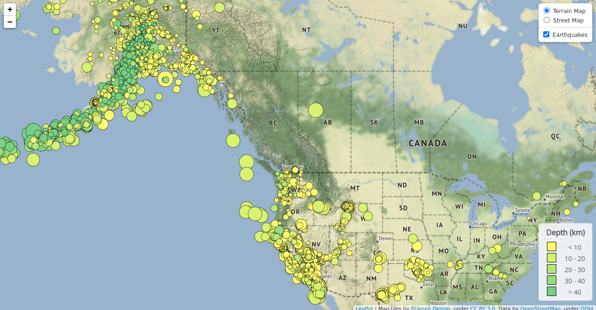
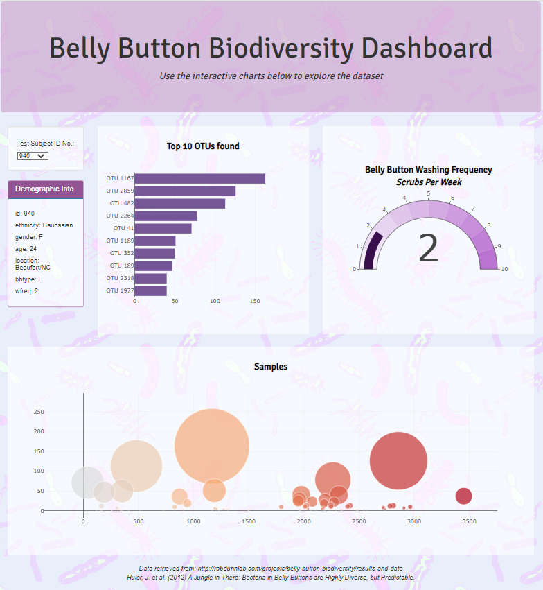
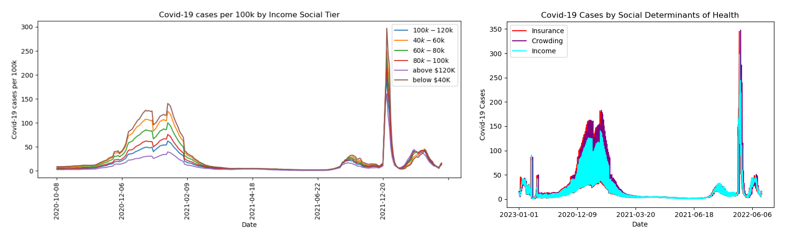
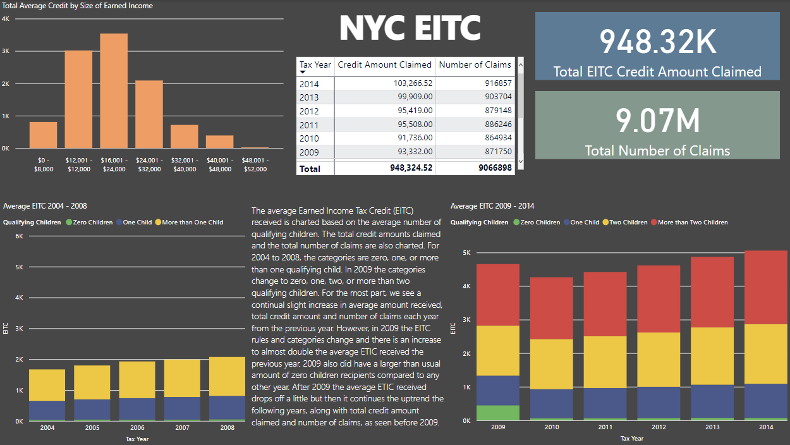
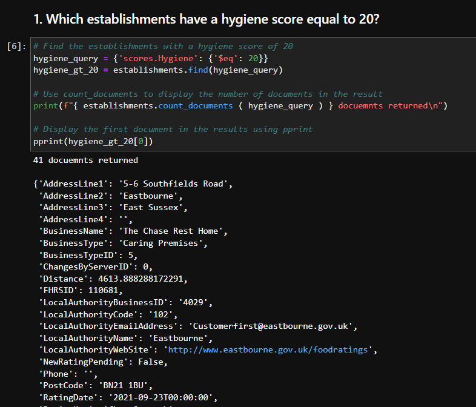
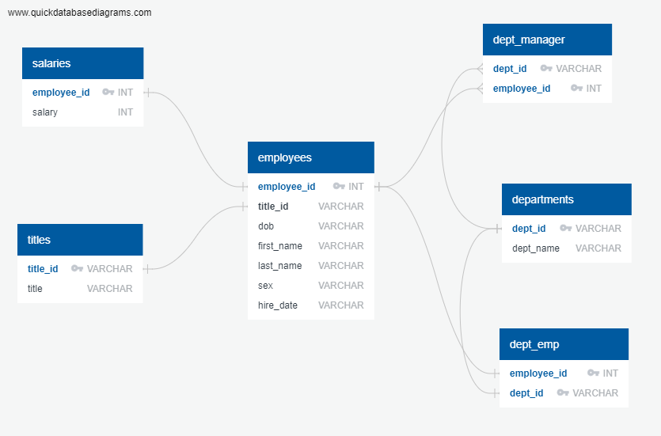
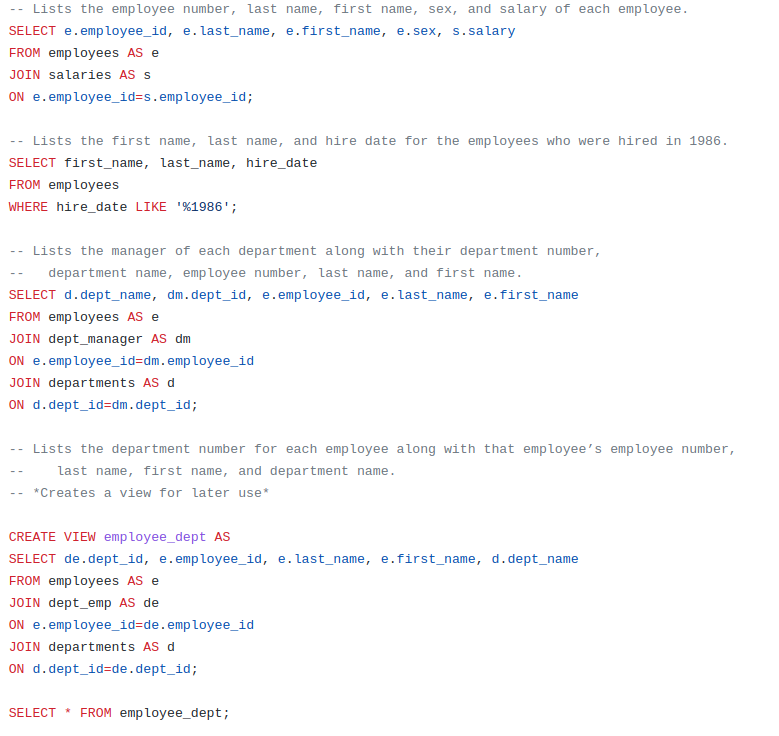
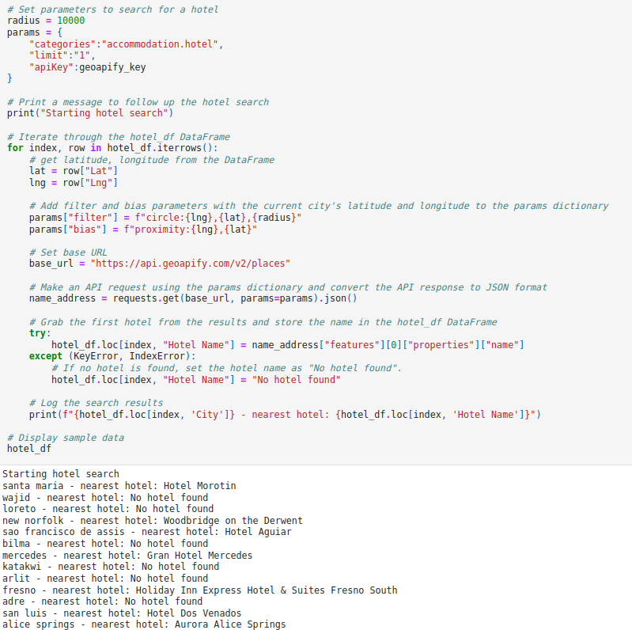

## Selected projects in data science, machine learning and software engineering

---

### Leaflet map of earthquakes   
This Leaflet map displays USGS earthquake data for the last 30 days, with marker size based on magnitude and color scale based on depth of earthquake.   
 

    

<a href="https://justinepile.github.io/leaflet-challenge" target="_blank" rel="noopener noreferrer">View Map</a>   
<a href="https://github.com/JustinePile/leaflet-challenge" target="_blank" rel="noopener noreferrer">View Code on Github</a>
 

---

### Plotly Dashboard that explores the 'Belly Button Biodiversity' dataset
This Plotly Dashboard was created using JavaScript with HTML and CSS and it explores the 'Belly Button Biodiversity' dataset which catalogs the microbes that colonize human navels.

   

<a href="https://justinepile.github.io/belly-button-challenge" target="_blank" rel="noopener noreferrer">View Dashboard</a>   
<a href="https://github.com/JustinePile/belly-button-challenge" target="_blank" rel="noopener noreferrer">View Code on Github</a>
 

---

### An analysis of the impact of social determinants of health on COVID-19 case rates in California

Group project where we used Python dataframes and Matplotlib visualizations to analyze the impact of three social determinants of health (insurance, crowding, and income) on COVID-19 cases. For this project, I performed initial data manipulation and created the visualizations.

    

<a href="https://github.com/JustinePile/Project_1/blob/main/Project%201%20Slide%20Deck.pdf" target="_blank" rel="noopener noreferrer">View report PDF</a>
 <a href="https://github.com/JustinePile/Project_1/" target="_blank" rel="noopener noreferrer">View code on GitHub</a>

---

### PowerBI report of NYC EITC and Manhattan home sales

A brief report of NYC EITC total claims, total credit amount claimed, and average credit recieved, along with a brief report of Manhattan home sales by neighborhood.

   

<a href="https://github.com/JustinePile/Power_BI/blob/main/Predictive%20Data%20Lab.pdf" target="_blank" rel="noopener noreferrer">View report PDF</a>
 <a href="https://github.com/JustinePile/Power_BI" target="_blank" rel="noopener noreferrer">View code on GitHub</a>

---

### Evaluating various establishments across the United Kingdom using PyMongo
The scenario for this project was to evaluate some ratings data in order to help journalists and food critics decide where to focus future articles. Uses a JSON file to create a MongoDB database and then PyMongo in a Jupyter Notebook to anlayze the database.

   

   

<a href="https://github.com/JustinePile/nosql-challenge" target="_blank" rel="noopener noreferrer">View code on GitHub</a>

---

### PostgreSQL project to research about people whom a company employed during the 1980s and 1990s
Created an ERD to map out the database to be created, then created a schema SQL file, and finally created a queries SQL file to do data analysis.

<a href="https://github.com/JustinePile/sql-challenge" target="_blank" rel="noopener noreferrer">View code on GitHub</a>

---

### Using the OpenWeatherMap and Geoapify Python API's

WeatherPy utilizes the OpenWeatherMap API to collect data for analysis of relationships between variables to ultimately allow the data to be filtered so as to only have cities with idealized weather conditions. Then, VacationPy, using the Geoapify API, finds the nearest hotel to each city and plots that on a map.   

    

 	  

<a href="https://github.com/JustinePile/python-api-challenge/blob/main/WeatherPy/WeatherPy.ipynb" target="_blank" rel="noopener noreferrer">View WeatherPy Notebook</a>
 <a href="https://github.com/JustinePile/python-api-challenge/blob/main/VacationPy/VacationPy.ipynb" target="_blank" rel="noopener noreferrer">View VacationPy Notebook</a>
 <a href="https://github.com/JustinePile/python-api-challenge" target="_blank" rel="noopener noreferrer">View code on GitHub</a>

---

### Visual Basic for Applications macro script to analyze stock data in Microsoft Excel

VBA Excel script to loop through a spreadsheet of stock data and give various outputs including the yearly change in price for each stock as well as the percentage change, the greatest percent increase and the greatest percent decrease, and the greatest total volume.

  

<a href="https://github.com/JustinePile/VBA-challenge" target="_blank" rel="noopener noreferrer">View code on GitHub</a>

<!-- https://github.com/Ileriayo/markdown-badges -->
